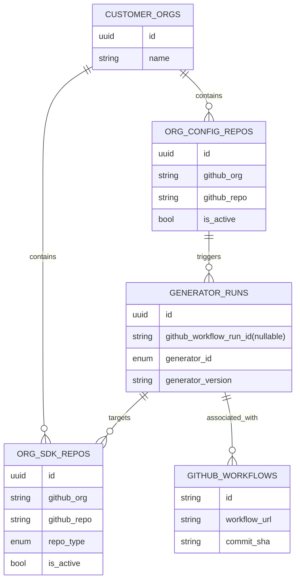

```mermaid
erDiagram
    CUSTOMER_ORGS {
        uuid id
        string name
    }

    CUSTOMER_ORGS ||--o{ ORG_SDK_REPOS : contains
    CUSTOMER_ORGS ||--o{ ORG_CONFIG_REPOS : contains

    ORG_SDK_REPOS {
        uuid id
        string github_org
        string github_repo
        enum repo_type
        bool is_active
    }

    ORG_CONFIG_REPOS {
        uuid id
        string github_org
        string github_repo
        bool is_active
    }

    GENERATOR_RUNS {
        uuid id
        string github_workflow_run_id(nullable)
        enum generator_id
        string generator_version
    }

    ORG_CONFIG_REPOS ||--o{ GENERATOR_RUNS : triggers

    GENERATOR_RUNS ||--o{ ORG_SDK_REPOS : targets

    GITHUB_WORKFLOWS {
        string id
        string workflow_url
        string commit_sha
    }

    GENERATOR_RUNS ||--o{ GITHUB_WORKFLOWS : associated_with
```